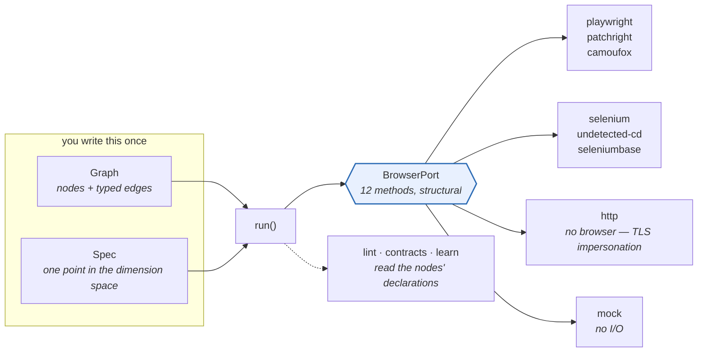
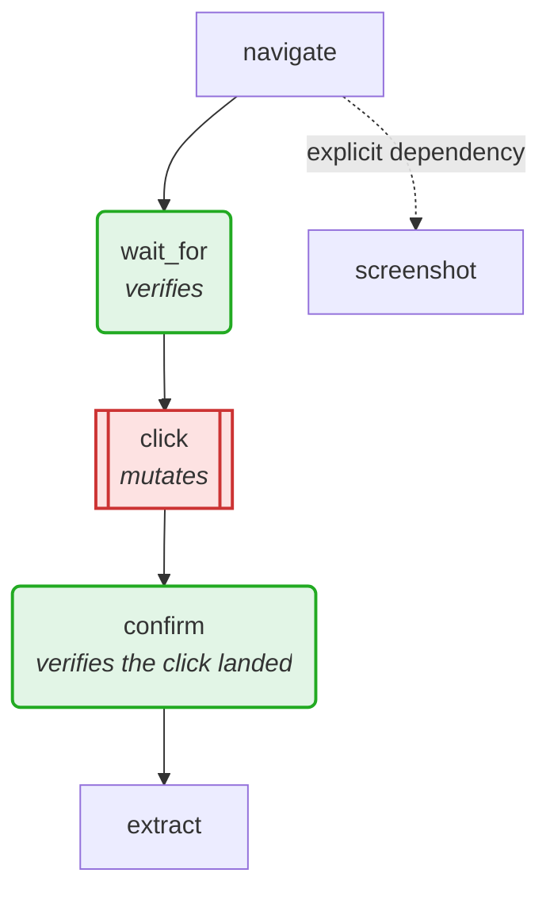

# browsergraph

[](https://github.com/aidonerightcorp/browsergraph/actions/workflows/ci.yml)
[](LICENSE)
[](https://www.python.org/)
[](pyproject.toml)
[](tests/)
[](https://www.kaggle.com/code/taylorsamarel/browsergraph-composable-browser-automation)

Composable browser automation. Any engine × binary × transport × display ×
stealth × behaviour, driven by reusable nodes in a graph, with optional
Ollama-powered steps.

Write a graph once — it runs on Playwright, Patchright, Selenium,
undetected-chromedriver, SeleniumBase, nodriver, Camoufox or a mock, without
changing a line.

**Core is stdlib-only.** Engines are optional extras, so `pip install
browsergraph` is small and the test suite runs anywhere — no browser, no network.

**Try it without installing anything:** the
[Kaggle notebook](https://www.kaggle.com/code/taylorsamarel/browsergraph-composable-browser-automation)
runs the whole tour in a browser-less environment.

### How it fits together



Nodes never touch an engine. They talk to `BrowserPort`, and that seam is the whole
reason one graph runs everywhere — including on the engine that has no browser at all.

### A graph, and the question a diagram should answer



Red changes remote state; green checks an outcome. A graph with red and no green after
it is what **BG003** flags — and it is the shape that produced 551 "successful" sends and
zero posts. `graph.to_mermaid()` emits this for any graph; `graph.to_html()` renders it
interactively, hover-for-contract, in a notebook.

### One graph, or no browser at all

Most pages are server-rendered and need no browser. `Engine.HTTP` fetches them
with a real browser's TLS fingerprint (`curl-cffi`), which is the layer anti-bot
vendors check *before any JavaScript runs*:

```
                        https://www.python.org, best of 3
HTTP        0.14s   ->  'Welcome to Python.org'
PLAYWRIGHT  1.08s   ->  'Welcome to Python.org'     # 7.7x slower, same answer
```

It refuses `eval_js`, `type` and `screenshot` rather than silently no-opping —
a driver that pretends surfaces later as missing data with no explanation.

---

## Install

```bash
pip install browsergraph                 # core: mock engine, graphs, sampling
pip install browsergraph[playwright]     # + playwright
pip install browsergraph[selenium]       # + selenium & undetected-chromedriver
pip install browsergraph[all]            # everything

playwright install chromium              # browser binaries, if using playwright
```

Check what your machine can actually run:

```bash
browsergraph doctor
```

```
[ok  ] python>=3.10                3.12.3
[ok  ] engine:playwright           import playwright
[MISS] engine:camoufox             import camoufox
       fix: pip install camoufox[geoip]
[ok  ] binary:system chrome        /usr/bin/google-chrome
[MISS] display:xvfb                not installed
       fix: apt install xvfb  (needed for unattended headed runs)
[ok  ] ollama:reachable            http://localhost:11434 (3 models)
[ok  ] ollama:model                glm-5.2
```

Every missing check carries the command that fixes it.

---

## Quick start

```python
from browsergraph import Graph, Spec, Engine, Stealth, Behavior, run
from browsergraph.nodes.actions import Navigate, Click, Extract
from browsergraph.drivers import build

spec = Spec(engine=Engine.PATCHRIGHT,
            stealth=Stealth.UNDETECTED,
            behavior=Behavior.humanlike())

graph = (Graph("scrape")
         .add(Navigate("https://example.com"))
         .add(Click("#accept", optional=True))
         .add(Extract("h1", into="heading")))

result = run(graph, spec, build(spec))
print(result.summary(), result.context.data["heading"])
```

Swap `Engine.PATCHRIGHT` for `Engine.SELENIUM_UC` and the same graph runs on
undetected-chromedriver.

### As config, not code

```yaml
# login.yaml
spec:
  engine: selenium_uc
  binary: system_chrome
  stealth: undetected
  behavior: humanlike
  llm: {mode: selector, model: glm-5.2}
nodes:
  - {kind: navigate, url: "https://example.com"}
  - {kind: wait_for, selector: "#login"}
  - {kind: type, selector: "#user", text: "someone"}
  - {kind: click, selector: "#login"}
  - {kind: extract, selector: "h1", into: heading}
```

```bash
browsergraph run login.yaml --json
browsergraph run login.yaml --engine playwright    # same graph, other engine
```

---

## Docker

```bash
docker compose up --build          # service on :8800 + ollama
docker compose run --rm browsergraph doctor
```

One image, two modes — `ENTRYPOINT` is the CLI, `CMD` is `serve`:

```bash
docker run -p 8800:8800 browsergraph                       # HTTP service
docker run --rm browsergraph combos --engine selenium_uc   # one-shot CLI
```

```bash
curl localhost:8800/health
curl localhost:8800/doctor
curl -X POST localhost:8800/run -d '{
  "spec": {"engine": "playwright"},
  "nodes": [{"kind": "navigate", "url": "https://example.com"}]
}'
```

Build args pick what's baked in:

```bash
docker build --build-arg EXTRAS=selenium --build-arg INSTALL_BROWSERS= .
```

Two settings that matter and are easy to miss: `shm_size: 1gb` (Chrome crashes
on Docker's 64 MB default) and an explicit `mem_limit` (a browser will happily
consume the host).

---

## Ollama setup

LLM nodes are **optional** — graphs run fully scripted with no model. When you
want one:

```bash
export OLLAMA_HOST=http://localhost:11434   # or a remote/cloud endpoint
export OLLAMA_MODEL=glm-5.2
export OLLAMA_API_KEY=...                   # sent as Bearer, for gateways
```

| Variable | Default | Notes |
|---|---|---|
| `OLLAMA_HOST` | `http://localhost:11434` | In Docker use `http://ollama:11434`, or `host.docker.internal` for a host install |
| `OLLAMA_MODEL` | `glm-5.2` | `browsergraph doctor` warns if it isn't pulled |
| `OLLAMA_API_KEY` | *(unset)* | Only needed by gateways requiring auth |
| `BG_LLM_MODE` | `none` | `none / selector / verify / plan / agent` |

Modes, cheapest first:

- **`none`** — fully scripted, zero tokens
- **`selector`** — model resolves a selector **only when the scripted one fails**,
  so a working graph costs nothing
- **`verify`** — model checks the outcome after acting
- **`plan`** — model plans steps up front
- **`agent`** — model drives the loop

If the model is unreachable, LLM nodes **fail loudly** rather than guessing. A
hallucinated selector that half-works is worse than a clean failure.

---

## Engines

Engines that cannot co-install (camoufox pins its own playwright) run in their
own virtualenv via a worker process — see [ISOLATION.md](ISOLATION.md):

```bash
browsergraph envs create --name camoufox
```
```python
Spec(engine=Engine.CAMOUFOX, binary=Binary.FIREFOX, isolated=True)
```

| Engine | Install | Binaries | Notes |
|---|---|---|---|
| `playwright` | `playwright` | chromium, chrome, brave, firefox, webkit | Fastest, most detectable |
| `playwright_stealth` | `playwright-stealth` | chromium family | Patched navigator |
| `patchright` | `patchright` | chromium family | Drop-in stealth playwright |
| `camoufox` | `camoufox[geoip]` | firefox | Hardened firefox; local only |
| `selenium` | `selenium` | chromium family, firefox | Baseline webdriver |
| `selenium_uc` | `undetected-chromedriver` | chrome family | Not grid-compatible |
| `seleniumbase` | `seleniumbase` | chrome family | UC mode plus tooling |
| `nodriver` | `nodriver` | chrome family | UC successor, no webdriver binary |
| `cdp` | `websockets` | chromium family | Raw DevTools |
| `mock` | — | any | In-memory, for tests and dry runs |

Verified live on this machine: playwright, patchright, selenium, selenium_uc in-process, camoufox isolated — all passing the same cross-engine conformance suite.

`browsergraph engines` shows which are usable right now.

---

## Dimensions and sampling

```bash
browsergraph dimensions              # every axis and its values
browsergraph combos --why            # runnable combinations + rejection reasons
browsergraph sample                  # pairwise covering array
```

Incompatible combinations are rejected **with reasons**, so a smaller sweep is
explained rather than mysterious:

```
selenium + webkit          → selenium has no webkit driver
playwright + undetected    → needs an evasion engine (patchright, selenium_uc, …)
selenium_uc + grid         → cannot run on selenium grid
headed + remote transport  → a remote browser can't use this host's display
```

Full enumeration explodes, so `sample` builds a **pairwise covering array** —
every value-pair exercised in tens of runs instead of thousands. Most failures
are two-value interactions, so this catches them at a fraction of the cost.

Presets: `fast`, `human`, `undetected`, `camoufox`, `stealth_remote`,
`llm_agent`, `test`.

See [DIMENSIONS.md](DIMENSIONS.md) for the axes still worth adding — network/TLS
fingerprinting, session warmth, challenge handling, and verification — and why
verification matters most.

---

## Architecture

```
core:      Spec (dimensions) + Graph (DAG) + Context (state)
ports:     BrowserPort — 12 methods every engine implements
drivers:   playwright / selenium / mock adapters
nodes:     actions (navigate, click, type, …) + llm (selector, verify)
```

**Action nodes talk only to `BrowserPort`, never to an engine.** That is what
makes "any engine × any action" real rather than two implementations that drift.
Adding an engine means writing one adapter and touching no nodes.

## Prerequisites

| Need | When | Install |
|---|---|---|
| Python ≥ 3.10 | always | — |
| Engine package | non-mock runs | `pip install browsergraph[<engine>]` |
| Browser binary | non-mock runs | `playwright install chromium`, or system Chrome/Firefox |
| `DISPLAY` | `display=headed` | a real X session |
| `xvfb` | unattended headed runs | `apt install xvfb` |
| `ffmpeg` | video capture | `apt install ffmpeg` |
| Ollama | LLM nodes only | [ollama.com](https://ollama.com) + `ollama pull <model>` |
| `shm_size ≥ 1gb` | Chrome in Docker | compose setting |

`browsergraph doctor` checks all of these and prints the fix for each miss.

## Contracts

Every check in this library reads a node's own declarations — the linter trusts
`mutates`, the scheduler trusts `reads`/`writes`. A node that misdeclares itself does not
fail; it silently switches those checks off. So declarations are enforced at all three
moments where that is possible: when the class is defined, when nodes are composed into a
graph, and while the graph runs.

```python
class Bad(Node):
    kind = "bad"
    writes = ("url")     # ContractError at import: a missing comma — this is a str
```

```bash
browsergraph nodes                    # every node kind and its contract
browsergraph graph g.yaml --mermaid   # a diagram; mutating nodes red, verifying green
```

See [CONTRACTS.md](CONTRACTS.md).

## Notebooks

Jupyter, Kaggle and Colab run every cell inside an asyncio loop, which Playwright's sync
API refuses to start in. `browsergraph` detects that and drives the adapter from a worker
thread, so `engine=playwright` works in a notebook with no extra setup — screenshots and
video included. There is a [runnable tour notebook](notebooks/browsergraph-tour.ipynb).

## Documentation

| | |
|---|---|
| [ARCHITECTURE.md](ARCHITECTURE.md) | the Protocol-vs-base-class seam |
| [CONTRACTS.md](CONTRACTS.md) | what a node promises, and the three moments it is checked |
| [DIMENSIONS.md](DIMENSIONS.md) | axes worth adding, and why verification matters most |
| [ISOLATION.md](ISOLATION.md) | conflicting engines in separate virtualenvs |
| [PLUGINS.md](PLUGINS.md) | the open plugin format |

## Development

```bash
pip install -e ".[dev]"
pytest -q          # 516 tests; no browser required, browser suites skip when absent
mypy browsergraph --ignore-missing-imports
ruff check browsergraph
```

MIT.
