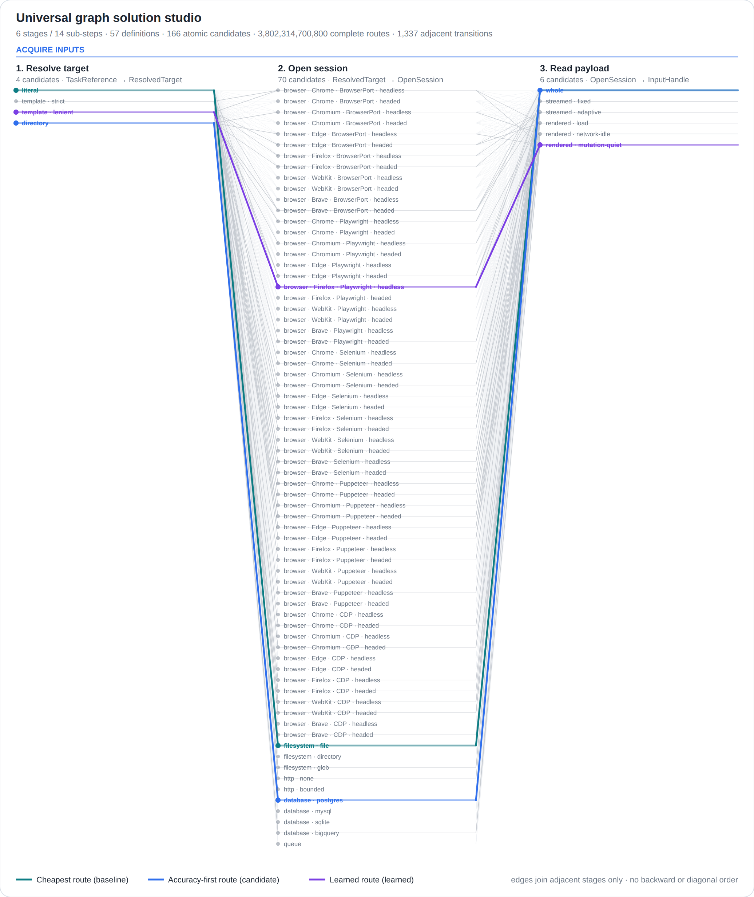
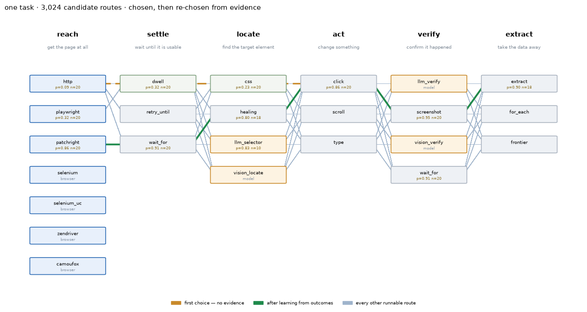

# browsergraph

[](https://github.com/aidonerightcorp/browsergraph/actions/workflows/ci.yml)
[](LICENSE)
[](https://www.python.org/)
[](pyproject.toml)
[](tests/)
[](https://aidonerightcorp.github.io/browsergraph/)
[](https://www.kaggle.com/code/taylorsamarel/browsergraph-composable-browser-automation)

**Write a browser automation once. Run it on any engine — or on none.**

Playwright, Patchright, Selenium, undetected-chromedriver, SeleniumBase, nodriver,
zendriver, pydoll, Botasaurus, rebrowser, Camoufox — or `engine=http`, which fetches with
a real browser's TLS fingerprint and no browser at all. Same graph, no code change.

```python
from browsergraph import Engine, Graph, Spec, run
from browsergraph.drivers import build
from browsergraph.nodes.actions import Click, Extract, Navigate, WaitFor

graph = (Graph("quote")
         .add(Navigate("https://example.com"))
         .add(WaitFor("#quote"))
         .add(Click("#quote"))
         .add(WaitFor("#result", name="confirm"))   # <- proves the click landed
         .add(Extract("#result", into="quote")))

spec = Spec(engine=Engine.PLAYWRIGHT)               # swap to HTTP, SELENIUM, ...
print(run(graph, spec, build(spec)).context.data)
```

## Install

```bash
pip install https://github.com/aidonerightcorp/browsergraph/releases/download/v0.3.0/browsergraph-0.3.0-py3-none-any.whl
browsergraph bootstrap        # gets a browser actually running, whatever it takes
browsergraph doctor           # what works here, and the command to fix what doesn't
```

The wheel on each release is installed into a clean virtualenv and exercised by
CI *before* it is offered — a package that builds and does not import is worse
than no package, because the failure lands on a stranger's machine instead of
in a log. Latest from git works too:

```bash
pip install "browsergraph[playwright] @ git+https://github.com/aidonerightcorp/browsergraph.git"
```

The core is **stdlib-only** — every engine is an optional extra, so a graph can be built,
linted and mock-run with nothing installed.

**Explore it in your browser, installing nothing:**
[the live studio](https://aidonerightcorp.github.io/browsergraph/) — all 166
candidates across 14 sub-steps, five synchronized views, one offline file.

**Try it without installing anything:** the
[Kaggle notebook](https://www.kaggle.com/code/taylorsamarel/browsergraph-composable-browser-automation)
installs a browser, drives it, and shows the screenshots and video it captured.

### Five notebooks that solve a real job

Start here. Each one takes real input, runs real code, and writes real files you
can open afterwards. They need nothing but the standard library, numpy and
Pillow, so they run anywhere.

| | Notebook | The job | Run it |
|---|---|---|---|
| 12 | [Browse and scrape](notebooks/12-browse-and-scrape.ipynb) | a web page in, clean product rows out | [Kaggle](https://www.kaggle.com/code/taylorsamarel/graph-jobs-1-browse-and-scrape) |
| 13 | [Ingest into a schema](notebooks/13-ingest-into-schema.ipynb) | mixed-format records in, typed rows plus rejects with reasons | [Kaggle](https://www.kaggle.com/code/taylorsamarel/graph-jobs-2-ingest-into-a-schema) |
| 14 | [Check and process an image](notebooks/14-check-and-process-image.ipynb) | images in, a report and resized copies out | [Kaggle](https://www.kaggle.com/code/taylorsamarel/graph-jobs-3-check-and-process-an-image) |
| 15 | [Clean up messy data](notebooks/15-clean-up-data.ipynb) | a messy table in, a clean one plus every change recorded | [Kaggle](https://www.kaggle.com/code/taylorsamarel/graph-jobs-4-clean-up-messy-data) |
| 16 | [Fit a model](notebooks/16-fit-a-model.ipynb) | a dataset in, regression and classification scores out | [Kaggle](https://www.kaggle.com/code/taylorsamarel/graph-jobs-5-fit-a-model) |

What they actually produce, not what they claim to: 3 products parsed from three
different price formats with the priceless one dropped and named; 6 records
accepted and 3 rejected with a reason each; a blank PNG caught by colour spread
where the file size and dimensions look fine; a `$1,340.00` row repaired after
its own comma split it in half; R² 0.991 and 98.2% accuracy from the same graph
with two steps swapped.

### Eleven notebooks about the model itself

The claim that this is a general model is only worth something if it works
somewhere else. Each of these runs in seconds, installs nothing but the library,
and touches no dataset or network. Every cell is executed and its output
committed.

| | Notebook | What it argues | Run it |
|---|---|---|---|
| 01 | [Express a problem as a graph](notebooks/01-build-a-graph.ipynb) | stages, ports, candidates, and the four checks | [Kaggle](https://www.kaggle.com/code/taylorsamarel/graph-solutions-1-express-a-problem-as-a-graph) |
| 02 | [Search without enumerating](notebooks/02-search-and-learn.ipynb) | 3.8 trillion routes is 41.8 bits, not an obstacle | [Kaggle](https://www.kaggle.com/code/taylorsamarel/graph-solutions-2-search-without-enumerating) |
| 03 | [A domain that is not browsing](notebooks/03-a-new-domain.ipynb) | the same machinery on document work | [Kaggle](https://www.kaggle.com/code/taylorsamarel/graph-solutions-3-a-domain-that-is-not-browsing) |
| 04 | [A Kaggle pipeline is a graph](notebooks/04-tabular-pipeline.ipynb) | numeric ∥ categorical encoding is a join | [Kaggle](https://www.kaggle.com/code/taylorsamarel/graph-solutions-4-a-kaggle-pipeline-is-a-graph) |
| 05 | [Two readings of one document](notebooks/05-document-extraction.ipynb) | text and layout are independent extractions | [Kaggle](https://www.kaggle.com/code/taylorsamarel/graph-solutions-5-two-readings-of-one-document) |
| 06 | [A workflow with no data science](notebooks/06-service-workflow.ipynb) | effects, permissions, and one step that reaches outside | [Kaggle](https://www.kaggle.com/code/taylorsamarel/graph-solutions-6-a-workflow-with-no-data-science) |
| 07 | [A gate that can say no](notebooks/07-data-quality-gate.ipynb) | schema and drift meeting at one decision | [Kaggle](https://www.kaggle.com/code/taylorsamarel/graph-solutions-7-a-gate-that-can-say-no) |
| 08 | [Build, verify, release](notebooks/08-release-pipeline.ipynb) | a gate with two inputs cannot be half-skipped | [Kaggle](https://www.kaggle.com/code/taylorsamarel/graph-solutions-8-build-verify-release) |
| 09 | [Retrieval is two searches](notebooks/09-retrieval-qa.ipynb) | dense and lexical recall, joined | [Kaggle](https://www.kaggle.com/code/taylorsamarel/graph-solutions-9-retrieval-is-two-searches) |
| 10 | [The leak you cannot see in CV](notebooks/10-timeseries-forecast.ipynb) | the split as a node with two named outputs | [Kaggle](https://www.kaggle.com/code/taylorsamarel/graph-solutions-10-the-leak-you-cannot-see) |
| 11 | [The domain this started in](notebooks/11-web-harvest.ipynb) | completed ≠ worked | [Kaggle](https://www.kaggle.com/code/taylorsamarel/graph-solutions-11-the-domain-this-started-in) |

All eleven are published public on Kaggle and ran there to completion — the
library is installed from this repository in cell one, so what you see rendered
is what the code in `main` actually does.

Regenerate and verify them with:

```bash
python notebooks/build_notebooks.py && python notebooks/build_domains.py
python notebooks/build_workflows.py
python notebooks/execute.py          # runs every cell, under a memory cap
```

---

## Why this exists

The interesting problem in browser automation is not clicking things. It is that **a run
which reports success can have accomplished nothing** — and you find out weeks later.

This library was written after an incident where 551 emails reported "sent" successfully
and produced zero posts. Every layer said success. Nothing checked the destination. So the
linter's flagship rule is BG003 — *changes remote state, never verifies the outcome* — and
the rest of the design follows from there.

```python
from browsergraph.lint import lint, report
print(report(lint(graph)))
# [WARN] BG003 click: graph changes remote state but never verifies the outcome
#        — a silent failure will look like success
```

## New here? Read this first

**[HOW_IT_WORKS.md](HOW_IT_WORKS.md)** — the whole architecture in plain
English: what a stage is, how settings expand into a matrix of concrete
options, how four trillion routes get narrowed to one, and what actually
happens when a step fails. No jargon, no prior context.

> Don't write the steps. Write down what has to be true, list everything that
> could make it true, and let the program pick — from evidence, with reasons it
> can show you.

## Sub-steps: the combinatorics a coarse diagram hides

Six stages, but "Acquire inputs" is not one decision — it is three. Work out
*what* to fetch, open a session capable of fetching it, read a payload out of
that session. Each has its own matrix.

[](https://aidonerightcorp.github.io/browsergraph/)

*One stage, its three sub-steps, all 80 candidates, three routes traced.
[The full 14-sub-step network →](docs/route-network.png)*

Draw each stage as a single pooled choice and you count **85,747,200** routes.
The sub-steps those same stages are actually made of expose
**3,802,314,700,800** — the coarse view was hiding **44,343×** of the space.
Same task, same registry, same code.

```
6 stages / 14 sub-steps · 57 definitions · 166 atomic candidates
3,802,314,700,800 complete routes · 1,337 adjacent transitions
```

Sub-steps are **recursive** — a sub-step can decompose again, to any depth. A
stage is either a leaf that holds candidates or a composite that holds
sub-steps, never both, because otherwise "one choice per stage" stops being well
defined and that sentence is what the whole model rests on.

```bash
browsergraph workbench -o studio.html   # five interactive views, one offline file
browsergraph route --compare            # greedy vs beam vs exhaustive, measured
browsergraph route --gates              # what a policy blocks, and why
```

Policy is a **hard gate that runs before scoring**: under a locked-down policy
(no browser, no network, no LLM, no external effects, deterministic only) the
space drops from 3.8 trillion to **1,959,552,000** routes — 99.95% removed
before a single score is computed, every removal stating its reason. Blocked
candidates stay *visible*; filtering them out silently would answer "what could
perform this step" with "what the policy left".

Measured, not asserted — [the full report](docs/ROUTE_SEARCH_REPORT.md) includes
the profile-ranking bug this found (all four objective profiles were secretly
identical) and the beam-search bug that made width buy nothing:

| profile | greedy (71 evals) | beam (512 evals) |
|---|---:|---:|
| Balanced | 0.8156 | 0.8156 |
| Quality first | 1.0149 | 1.0149 |
| **Speed first** | 0.9608 | **1.0304** |
| Cost first | 0.3443 | 0.3443 |

*Greedy scores each sub-step in isolation; route quality **compounds**, so it
loses whenever the trade-off is real. Decomposition also pushed the gated space
past the enumeration limit — exhaustive is no longer an option, which is exactly
when the strategy choice starts to matter.*

## The architecture

A task decomposes into ordered **stages**. Each stage offers every candidate that
could perform it; a route picks one per stage. That model is written down in full
— generalized past browsers, with portable manifests, contract validation, typed
feedback and optimization profiles — in
[**UNIVERSAL_GRAPH_SYSTEM.md**](UNIVERSAL_GRAPH_SYSTEM.md).

```bash
browsergraph workbench -o studio.html    # 6 stages, 149 candidates, 32,864,832 routes
```

The demonstration registry is domain-neutral on purpose: the same primitives
describe document ingestion, image processing, data cleaning and machine
learning. `Browser adapter` alone expands to **60 atomic candidates**
(5 controllers × 6 binaries × 2 display modes) — because drawing that as one box
hides fifty-nine decisions.

A task decomposes into **planes**. Each plane offers several interchangeable ways to
answer it. A route through them is one candidate solution — and the route is chosen from
evidence, not fixed in advance.



With no evidence the cheapest route wins: `http → dwell → css → click → screenshot →
extract` — no browser, no model. After a few dozen runs against a defended,
JavaScript-rendered site the same machinery picks `patchright → wait_for → healing → …`
and can say why: *6/6 steps measured*.

The planes are **derived from node contracts**, not written down. `click` is on *act*
because it declares `mutates`; adding a node adds a candidate and the diagram changes
with nobody editing it.

```bash
browsergraph planes --demo               # the planes and the chosen route
browsergraph planes --html planes.html   # both routes drawn over all the others
```

## Failure is a first-class path

When a configuration fails, the next one is tried — and the *diagnosis* chooses what to
try next, which is what makes it more than a retry loop.

```
1. http        ok=False  timeout        wait_retry
2. http        ok=False  timeout        wait_retry
3. playwright  ok=True                          → extracted: $49.00
```

A missing element on an engine with **no JavaScript runtime** suggests a different engine,
not a longer wait. Retries are bounded per spec — an unbounded retry never reaches the
rest of the ladder. A terminal diagnosis (CAPTCHA, block) stops immediately rather than
escalating into a ban, and `SiteMemory` puts the winner first next time.

## Every engine, every browser, headless and headed

Measured, not declared — a real launch matrix against a served page.
`browsergraph doctor` reports the same for your machine.

| engine | chromium | chrome | firefox | webkit | brave | headless | headed | xvfb |
|---|---|---|---|---|---|---|---|---|
| playwright | ✅ | ✅ | ✅ | ✅ | ✅ | ✅ | ✅ | ✅ |
| playwright_stealth | ✅ | ✅ | — | — | ✅ | ✅ | ✅ | ✅ |
| patchright | ✅ | ✅ | — | — | ✅ | ✅ | ✅ | ✅ |
| rebrowser | ✅ | ✅ | — | — | ✅ | ✅ | ✅ | ✅ |
| selenium | ✅ | ✅ | ✅ | — | ✅ | ✅ | ✅ | ✅ |
| selenium_uc | — | ✅ | — | — | ✅ | ✅ | ✅ | ✅ |
| seleniumbase | — | ✅ | — | — | ✅ | ✅ | ✅ | ✅ |
| botasaurus | — | ✅ | — | — | ✅ | ✅ | ✅ | ✅ |
| camoufox *(isolated)* | — | — | ✅ | — | — | ✅ | ✅ | ✅ |
| nodriver / zendriver / pydoll *(CDP)* | — | ✅ | — | — | ✅ | ✅ | ✅ | ✅ |
| http *(no browser)* | n/a | n/a | n/a | n/a | n/a | ✅ | — | ✅ |

**126 verified combinations.** What does not work is documented in
[ENGINES.md](ENGINES.md) with the reason — a bare protocol with no client library, a
chromedriver/snap version skew, a dependency that ships broken source.

## What comes in the box

| | |
|---|---|
| **Contracts** | nodes declare what they read, write and mutate — enforced at import, at composition and at run time ([CONTRACTS.md](CONTRACTS.md)) |
| **Linter** | BG001–BG009 over a graph, before a browser starts |
| **Escalation** | diagnose the failure, try the next configuration, remember the winner |
| **Learning** | outcomes generalise site → org → sector → platform → global |
| **Token reduction** | 8 preprocessing strategies, then keyword focus with neighbour expansion |
| **Extraction** | conservative, deterministic contacts / NAICS / articles — no model needed |
| **Politeness** | per-domain, process-wide rate limiting that honours robots `Crawl-delay` |
| **Isolation** | conflicting engines in per-engine virtualenvs, over a worker protocol |
| **Notebooks** | Jupyter/Kaggle/Colab run cells inside an asyncio loop; the sync API is driven from a worker thread so it just works |
| **Universal graph** | portable node manifests, atomic candidates, stage/route validation and a five-view studio — [UNIVERSAL_GRAPH_SYSTEM.md](UNIVERSAL_GRAPH_SYSTEM.md) |
| **Evidence** | per-candidate, per-context posteriors; Thompson-samples a route at *sum* cost instead of enumerating, and reports how many **bits** of the choice remain |
| **Route search** | policy gates first, then greedy / beam / exhaustive over the eligible space, reporting how much of it was actually examined |
| **Capabilities** | each engine declares what it can do — press, select, upload, download, frames, cookies, viewport, PDF — checked against a graph *before* a browser launches, with the engines that could run it |
| **Receipts** | every run writes durable evidence: route, engine, per-step timing, artifacts with content hashes, which steps verified, and a pasteable replay line — for failures too |
| **Model router** | ten jobs (extract, verify, locate, read-image, classify, embed, rerank, code, plan) routed to the right model with a recorded reason, instead of one default for everything |
| **Binaries** | fetches a browser or a driver *matched to the browser it will drive* — the fix for "cannot connect to chrome" |
| **OCR (optional)** | read a page from its pixels when the DOM cannot answer — canvas text, baked-in images, and "does this screenshot contain any text at all" |
| **LLM (optional)** | Ollama-compatible; the model is resolved from the host by *capability*, never hardcoded |

## Documentation

| | |
|---|---|
| [HOW_IT_WORKS.md](HOW_IT_WORKS.md) | **start here** — the architecture in plain English |
| [AGENTS.md](AGENTS.md) | instructions for an LLM harness, written as checkable constraints |
| [docs/TOWARD_A_GENERAL_MODEL.md](docs/TOWARD_A_GENERAL_MODEL.md) | a critical review — what is still wrong, and what to fix first |
| [QUICKSTART.md](QUICKSTART.md) | first graph, first real browser, first task |
| [UNIVERSAL_GRAPH_SYSTEM.md](UNIVERSAL_GRAPH_SYSTEM.md) | stages, candidates, routes, contracts, feedback, optimization |
| [docs/ROUTE_SEARCH_REPORT.md](docs/ROUTE_SEARCH_REPORT.md) | policy gating and route search, measured end to end |
| [ARCHITECTURE.md](ARCHITECTURE.md) | the Protocol-vs-base-class seam |
| [CONTRACTS.md](CONTRACTS.md) | what a node promises, and the three moments it is checked |
| [ENGINES.md](ENGINES.md) | every engine, what it is for, and what does not work |
| [DIMENSIONS.md](DIMENSIONS.md) | the axes, and why verification matters most |
| [ISOLATION.md](ISOLATION.md) | conflicting engines in separate virtualenvs |
| [PLUGINS.md](PLUGINS.md) | the open plugin format |
| [CONTRIBUTING.md](CONTRIBUTING.md) | how to add an engine, a node or an extraction path |

## Related

[**extractgraph**](https://github.com/aidonerightcorp/extractgraph) — the other half.
browsergraph *reaches* the page; extractgraph gets the data out of it, with several
independent paths, provenance, and the disagreements kept.

## Contributing

Issues and pull requests welcome — see [CONTRIBUTING.md](CONTRIBUTING.md). The most
useful contributions are a new engine adapter, a new extraction path, or a page that
breaks something.

```bash
pip install -e ".[dev]"
pytest -q                                  # 884 tests; browser suites skip when absent
mypy browsergraph --ignore-missing-imports
ruff check browsergraph tests
```

MIT.
