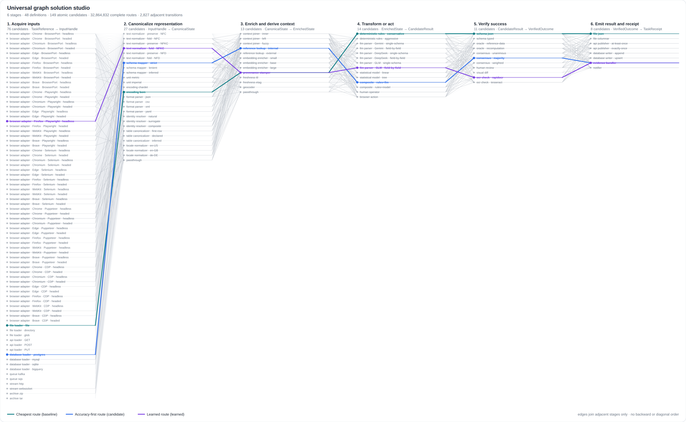

# Choosing a route out of 32,864,832

*A measured report on policy gating and route search over the browsergraph
workbench. Every number here was produced by the commands shown; none was typed
in by hand.*



---

## The space

```
6 stages · 48 definitions · 149 atomic candidates
76 × 27 × 13 × 14 × 11 × 8 = 32,864,832 complete primary routes
                             2,827 adjacent-stage transitions
```

Routes **multiply**. That is the entire reason a search is needed rather than a
table of recommendations.

## Policy is a hard gate, and it runs first

A candidate that lacks a required permission is not a low-scoring candidate; it
is an unavailable one. No objective weighting may promote it. Under a
locked-down policy — no browser, no network, no LLM, no external state changes,
deterministic runtimes only:

```bash
browsergraph route --gates --deterministic --no-effects \
  --allow filesystem --allow filesystem:read --allow filesystem:write \
  --allow database --allow database:read
```

| stage | eligible | of |
|---|---:|---:|
| Acquire inputs | 9 | 76 |
| Canonicalize representation | 27 | 27 |
| Enrich and derive context | 6 | 13 |
| Transform or act | 4 | 14 |
| Verify success | 7 | 11 |
| Emit result and receipt | 3 | 8 |

**122,472 complete routes remain, out of 32,864,832.** The policy removed
99.63% of the space before a single score was computed — and every removal
states its reason:

```
demo.acquire.browser_adapter.chrome.browserport.headless…  needs browser, network — not granted
demo.enrich.embedding_enricher.small…                      not deterministic
demo.emit.database_writer.append…                          changes external state (external:row-state) — not permitted
```

Blocked candidates stay **visible**. Filtering them out silently would answer
"what could perform this step" with "what the policy left", and nothing on
screen would distinguish the two.

## Scoring had to be fixed before any of this meant anything

The first implementation combined raw metric values directly:

```
score = 0.5·quality − 0.25·latency_ms − 0.25·cost_usd
```

A quality of 0.97 was being weighed against a latency of 1420 — three orders of
magnitude apart. The latency term swamped everything, and **all four profiles
produced an identical ranking**:

| profile | ranking before the fix |
|---|---|
| Balanced | fastest > cheapest > accuracy_first > learned > human_in_the_loop |
| Quality first | *identical* |
| Speed first | *identical* |
| Cost first | (only this one differed) |

"Balanced" and "quality first" were secretly both speed-only. Nothing failed;
the numbers just meant nothing. Min-max normalization within the comparison set
puts every objective on the same 0..1 footing, so a weight of 0.5 buys half the
decision. Afterwards:

| profile | ranking |
|---|---|
| Balanced | accuracy_first > learned > cheapest > fastest > human_in_the_loop |
| Quality first | accuracy_first > learned > **human_in_the_loop** > cheapest > fastest |
| Speed first | accuracy_first > learned > cheapest > fastest > human_in_the_loop |
| Cost first | accuracy_first > learned > cheapest > fastest > human_in_the_loop |

The human-in-the-loop route — highest quality, 35 minutes, $5.50 — moves from
last to third under *quality first* and stays last everywhere else. That is the
profile doing its job.

## Three strategies, and where the cheap one loses

```bash
browsergraph route --compare --profile profile.balanced --deterministic --no-effects \
  --allow filesystem --allow filesystem:read --allow filesystem:write \
  --allow database --allow database:read
```

| profile | greedy | beam(8) | exhaustive | greedy optimal? |
|---|---:|---:|---:|---|
| Balanced | 0.7355 | **0.7502** | **0.7502** | **no — loses 0.0147** |
| Quality first | 0.9426 | 0.9426 | 0.9426 | yes |
| Speed first | 0.9838 | 0.9838 | 0.9838 | yes |
| Cost first | 0.3242 | 0.3242 | 0.3242 | yes |

| strategy | routes examined | of 122,472 |
|---|---:|---:|
| greedy | 56 | 0.05% |
| beam(8) | 385 | 0.31% |
| exhaustive | 122,472 | 100% |

Greedy is optimal in three of four profiles and loses in the fourth, which is
exactly what you would predict: it scores each stage in isolation, and route
metrics do not decompose. **Quality compounds** — it is the product across
stages, not the mean, because a route is only as good as the joint probability
that every step did its job. Averaging would let one excellent stage hide a step
that fails half the time.

Beam finds the optimum here for 385 evaluations instead of 122,472 — 0.3% of
the work for the same answer.

### The beam was broken, and the measurement is what caught it

The first beam renormalized within each step's own set of surviving partials, so
the yardstick moved at every stage: a genuinely good prefix got pruned because
it looked ordinary against whatever happened to survive beside it. The symptom
was unmistakable once measured —

| beam width | 1 | 8 | 32 | 128 | 512 |
|---|---:|---:|---:|---:|---:|
| score (before) | 0.6952 | 0.6952 | 0.6952 | 0.6952 | 0.6952 |
| routes examined | 56 | 385 | 892 | 2,812 | 8,878 |

— beam matched plain greedy at *every* width, spending 8,878 evaluations to
reach the answer greedy found in 56. **A search whose width buys nothing is not
a search.** Scoring partial routes against fixed reference ranges fixed it.

A second bug surfaced the same way: normalization originally recomputed min/max
inside the scoring call, making ranking O(n²). An exhaustive pass over 122,472
routes did roughly fifteen billion comparisons and never finished. Nothing was
*wrong* with the answer — it just could not be reached, which for a search
strategy is the same thing.

## What a proposal reports

```bash
browsergraph route --profile profile.quality
```

```
beam search under 'profile.quality' — score 1.133, better than 100.0% of the reference sample
  Acquire inputs               file loader · directory
  Canonicalize representation  encoding bom
  Enrich and derive context    provenance stamper
  Transform or act             composite · rules+llm
  Verify success               consensus · majority
  Emit result and receipt      file json
  route metrics: quality 0.849 (compounded) · 4,719ms · $0.0340
  examined 660 of 32,864,832 eligible routes (0.0%) — 32,864,832 exist before policy
  needs: filesystem:read, filesystem:write, llm
  note: auto chose beam: 32,864,832 eligible routes exceeds the 200,000 enumeration limit
```

Three things in that output are deliberate:

**`examined 660 of 32,864,832 … (0.0%)`.** A search that looks at 660 routes and
announces "the best route" without saying so is making a claim it did not earn.
The number is free to carry.

**`needs: filesystem:read, filesystem:write, llm`.** The union of authority the
whole route requires. Per-candidate, each permission looks small; the union is
what actually has to be granted.

**`score 1.133`.** A normalized score *can* exceed 1 — the reference sample sets
the scale, and a good search finds routes better than anything sampled. That
reads like a bug, so the headline is the percentile, which cannot.

## Whole-route budgets are re-checked after the route exists

A route assembled entirely from individually affordable candidates can still
break a whole-route budget. Proposals are re-gated against the complete route,
and the message says exactly that:

```
PROBLEM: the whole route costs $0.0412, over the $0.03 budget
         — every candidate was individually affordable
```

## Reproducing all of it

```bash
pip install -e ".[dev]"
browsergraph route --gates                    # what the policy blocks, and why
browsergraph route --compare                  # greedy vs beam vs exhaustive
browsergraph route --profile profile.quality --json
browsergraph workbench -o studio.html         # the interactive five-view studio
pytest tests/test_workbench.py tests/test_search.py -q
```

## What is still an illustration

Every metric in the demonstration registry carries
`"source": "illustrative-prior"`, and a test enforces it. They exist to give the
search something to sort by. **Real optimization consumes real receipts** —
these numbers demonstrate that the machinery ranks, gates and reports correctly,
not that any particular candidate is good.
